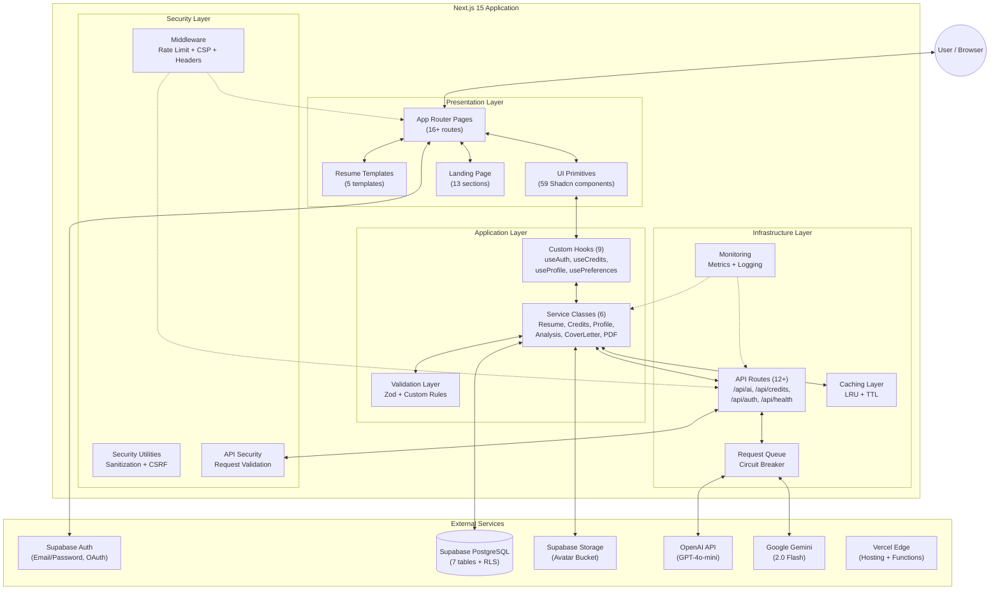

# System Architecture

ApexResume follows a **modular, layered architecture** with strict separation of concerns. The application is built as a Next.js 15 App Router project with React 19, using Supabase as the backend-as-a-service for authentication, database, and storage.

---

## 1. High-Level Architecture Diagram



---

## 2. Architectural Layers (Detailed)

### 2.1 Presentation Layer

**Location**: `app/`, `components/`, `app/components/`

The entry point for all user interaction. It is responsible for rendering state and capturing user input.

| Directory | Purpose | Key Files |
|-----------|---------|-----------|
| `app/page.tsx` | Landing page (public) | Hero, Features, Pricing, Templates, CTA |
| `app/dashboard/` | Authenticated dashboard | Resume list, create/edit/delete |
| `app/profile/` | User profile & settings | Profile, Notifications, Security, Billing |
| `app/onboarding/` | First-time user setup | Guided onboarding wizard |
| `app/blogs/` | Blog system (MDX) | 8 career-focused articles |
| `app/cover-letters/` | Cover letter management | AI-generated cover letters |
| `app/admin/` | Admin panel | Security dashboard |
| `app/components/` | Core app components | ResumeBuilder (75KB), AIModal, ResumeAnalysis |
| `app/components/templates/` | Resume templates | 5 templates + preview system |
| `components/landing/` | Landing page sections | 13 modular section components |
| `components/ui/` | Shadcn/ui primitives | 59 accessible UI components |
| `components/credits/` | Credits UI | Balance display, purchase modal, history |
| `components/profile/` | Profile components | 7 profile-related components |
| `components/seo/` | SEO components | Structured data, meta tags |

#### Provider Tree (Root Layout)

The root layout (`app/layout.tsx`) wraps the entire app in a deeply nested provider tree:

```
<html>
  <body>
    <StructuredData />          ← SEO: Organization + WebApp + SoftwareApp schemas
    <ThemeProvider>              ← next-themes: light/dark mode
      <AuthProvider>            ← Supabase Auth: user, session, signIn/signOut
        <PreferencesProvider>   ← User preferences: language, theme, timezone
          <CreditsProvider>     ← AI credits: balance, consumption
            <ProfileProvider>   ← User profile: fullName, avatar, settings
              {children}
              <Toaster />       ← Toast notifications (sonner)
            </ProfileProvider>
          </CreditsProvider>
        </PreferencesProvider>
      </AuthProvider>
    </ThemeProvider>
  </body>
</html>
```

### 2.2 Application Layer

**Location**: `hooks/`, `lib/`

Contains the "brain" of the application — orchestrating data flow, state management, and business logic.

#### Custom Hooks (9 total)

| Hook | File | Purpose |
|------|------|---------|
| `useAuth` | `hooks/use-auth.tsx` | Manages Supabase Auth state: `user`, `session`, `signIn()`, `signOut()`, `signUp()` |
| `useCredits` | `hooks/use-credits.tsx` | AI credit balance, consumption, purchase flow, feature cost lookup |
| `useProfile` | `hooks/use-profile.tsx` | User profile data fetching and caching |
| `usePreferences` | `hooks/use-preferences.tsx` | User preferences (theme, language, timezone, date format, currency) |
| `useDebouncedCallback` | `hooks/use-debounced-callback.ts` | Debounces callbacks for auto-save (prevents excessive DB writes while typing) |
| `usePerformance` | `hooks/use-performance.tsx` | Client-side performance monitoring and metrics |
| `useMobile` | `hooks/use-mobile.tsx` | Responsive breakpoint detection |
| `useScrollHide` | `hooks/use-scroll-hide.tsx` | Auto-hide navigation on scroll |
| `useToast` | `hooks/use-toast.ts` | Toast notification management (sonner wrapper) |

#### Service Classes (6 total)

| Service | File | Methods | Purpose |
|---------|------|---------|---------|
| `ResumeService` | `lib/resume-service.ts` | `getUserResumes`, `createResume`, `updateResume`, `deleteResume`, `getResume`, `getMultipleResumes` | CRUD operations on resumes with caching |
| `CreditsService` | `lib/credits-service.ts` | `checkCredits`, `consumeCredits`, `addCredits`, `getCreditBalance`, `getCreditHistory`, `getMonthlyStats` | AI credit economy management |
| `ProfileService` | `lib/profile-service.ts` | `getUserProfile`, `updateUserProfile`, `uploadAvatar`, `getNotificationSettings`, `getSecuritySettings`, `deleteAccount` | Full user profile lifecycle |
| `AnalysisService` | `lib/analysis-service.ts` | `getAnalysis`, `getAnalysesForResume`, `saveAnalysis`, `deleteAnalysis` | AI analysis persistence (upsert pattern) |
| `CoverLetterService` | `lib/cover-letter-service.ts` | Cover letter generation & improvement | AI-powered cover letter workflows |
| `PDFGenerator` | `lib/pdf-generator.ts` | PDF generation, page breaks, font embedding | Client-side PDF export pipeline |

### 2.3 Domain Layer

**Location**: `types/`

The semantic core defining all data structures used across the application.

```typescript
// types/resume.ts — Root interfaces

ResumeData {
  personalInfo: PersonalInfo    // name, title, email, phone, location, summary, linkedin, website
  experience: Experience[]      // id, jobTitle, company, date, location, responsibilities, achievements[]
  education: Education[]        // id, degree, school, date, location, gpa, honors[], relevantCourses[]
  skills: Skills                // languages, frameworks, tools, other, technical[], soft[]
  projects: Project[]           // id, name, description, technologies, date, url, github, highlights[]
  references?: Reference[]      // id, name, title, company, email, phone, relationship
  customSections?: CustomSection[] // id, title, content, type: text|list|table
  analysis?: ResumeAnalysis     // Persisted AI analysis data
}

ResumeAnalysis {
  skillsAnalysis: SkillAnalysis[]   // name, proficiency (0-100), category
  jobMatches: JobMatch[]            // title, matchPercentage, reasoning, salaryRange
  summary: string                   // AI-generated analysis summary
}

CoverLetterRequest / CoverLetterResponse  // Cover letter I/O types
APIResponse<T> = APISuccess<T> | APIError  // Generic API response wrapper
```

### 2.4 Infrastructure Layer

**Location**: `lib/supabase.ts`, `lib/supabase-admin.ts`, `app/api/`, `middleware.ts`

Handles all communication with external services and enforces security at the edge.

#### Supabase Clients

| Client | File | Usage |
|--------|------|-------|
| **Standard** | `lib/supabase.ts` | Client-side operations, respects RLS, used by services |
| **Admin** | `lib/supabase-admin.ts` | Server-side only, bypasses RLS, used for credit operations |

#### API Routes

| Endpoint | Method | Purpose |
|----------|--------|---------|
| `/api/ai/analyze` | POST | Comprehensive resume analysis (GPT-4o) |
| `/api/ai/generate` | POST | Content generation (summary, experience, project) |
| `/api/ai/generate-cover-letter` | POST | Cover letter generation |
| `/api/ai/parse-resume` | POST | Resume file parsing (PDF upload) |
| `/api/ai/skill-job-match` | POST | Skill-to-job matching analysis |
| `/api/ai/analysis` | GET/POST | Saved analysis CRUD |
| `/api/ai/diagnostic` | GET | AI configuration diagnostic |
| `/api/credits` | GET/POST | Credit balance & consumption |
| `/api/credits/history` | GET | Credit usage history |
| `/api/credits/purchase` | POST | Create Stripe checkout session |
| `/api/credits/webhook` | POST | Stripe webhook handler |
| `/api/auth/callback` | GET | Supabase OAuth callback |
| `/api/health` | GET | System health check |

#### Security Middleware (`middleware.ts`)

Runs on **every request** (except static assets). Implements:

1. **IP Blocking** — Maintains a blocklist of malicious IPs
2. **Header Validation** — Blocks requests without user-agent, blocks suspicious bot patterns (sqlmap, nikto)
3. **Burst Protection** — Max 20 requests per 5 seconds per IP
4. **Sliding Window Rate Limiting** — Path-specific limits:
   - General: 120 req/min
   - `/api/*`: 60 req/min
   - `/api/ai/*`: 15 req/min
   - `/api/auth/*`: 20 req/min
5. **Security Headers** — HSTS, X-Frame-Options, CSP, etc.
6. **Rate Limit Headers** — `X-RateLimit-Limit`, `X-RateLimit-Remaining`, `X-RateLimit-Reset`

---

## 3. Key Design Decisions

### 3.1 JSONB for Resume Data
Resume content is stored as a flexible `jsonb` column in PostgreSQL rather than normalized tables. This allows:
- Schema evolution without migrations
- Atomic saves of the entire resume state
- Client-side flexibility in adding custom sections
- Efficient reads (single query for all resume data)

### 3.2 Dual AI Engine Support
The app supports both OpenAI and Google Gemini, with OpenAI as the primary provider:
- **OpenAI GPT-4o-mini**: Primary engine for content generation and analysis
- **Google Gemini 2.0 Flash**: Secondary/fallback engine
- AI provider is configurable via `lib/ai-config.ts`

### 3.3 Client-Side PDF Generation
PDFs are generated entirely on the client using `html2canvas` + `jsPDF`:
- **Privacy**: Resume data never leaves the browser for PDF generation
- **Speed**: No server round-trip needed
- **Fidelity**: Template HTML is rendered at 2x DPI for print quality
- **Multiple strategies**: Three PDF generator implementations for reliability (`pdf-generator.ts`, `html-pdf-generator.ts`, `simple-pdf-generator.ts`)

### 3.4 Atomic Credit Operations
Credits are consumed via a PostgreSQL stored procedure (`deduct_credits`) that uses `FOR UPDATE` row locks:
- Prevents race conditions during concurrent AI requests
- Single atomic transaction: deduct + log usage
- Tier-aware maximum credit caps

### 3.5 Provider-Based State Architecture
Global state is managed through nested React Context providers rather than a state management library:
- **AuthProvider** → session, user
- **PreferencesProvider** → theme, language
- **CreditsProvider** → balance, consumption
- **ProfileProvider** → profile data
- Each provider independently fetches and caches its own data

### 3.6 Shadcn/ui Design System
UI components are built on **Radix UI** primitives wrapped with Tailwind CSS via Shadcn/ui:
- 59 accessible, composable UI components
- Consistent design tokens via `tailwind.config.ts`
- Class variance authority (`cva`) for component variants
- Dark mode support via CSS variables

### 3.7 Edge-Compatible Middleware
The security middleware is designed to run on Vercel's Edge Runtime:
- No Node.js-specific APIs
- In-memory rate limiting (Map-based, auto-cleanup)
- Efficient O(1) lookups for IP checks

---

## 4. Application Pages (Route Map)

```
/                          → Landing page (public)
/dashboard                 → Resume dashboard (authenticated)
/dashboard/[id]            → Resume builder/editor
/profile                   → User profile & settings
/onboarding                → First-time user onboarding
/cover-letters             → Cover letter management
/blogs                     → Blog index
/blogs/[slug]              → Individual blog post
/faq                       → FAQ page
/privacy                   → Privacy policy
/terms                     → Terms of service
/admin                     → Admin/security dashboard
/setup                     → Initial setup wizard
/reset-password            → Password reset flow
/unauthorized              → 401 error page
/maintenance               → Maintenance mode page
```

---

## 5. Build & Bundle Strategy

Configured in `next.config.mjs` for optimal production performance:

| Optimization | Configuration |
|-------------|---------------|
| **Output** | `standalone` (Docker-ready) |
| **Source Maps** | Disabled in production |
| **Tree Shaking** | Optimized imports for Radix UI, Lucide, Recharts |
| **Chunk Splitting** | Vendor, UI, and common chunks |
| **Image Formats** | WebP + AVIF with 30-day cache |
| **Static Caching** | 1-year cache for `/_next/static/` |
| **API Caching** | `no-cache, no-store` for all `/api/` routes |

### Vercel Configuration (`vercel.json`)

| Setting | Value |
|---------|-------|
| **Region** | `iad1` (US East) |
| **AI Functions Timeout** | 60 seconds |
| **Credits Functions Timeout** | 30 seconds |
| **Health Functions Timeout** | 10 seconds |
| **CORS** | Enabled for all API routes |
