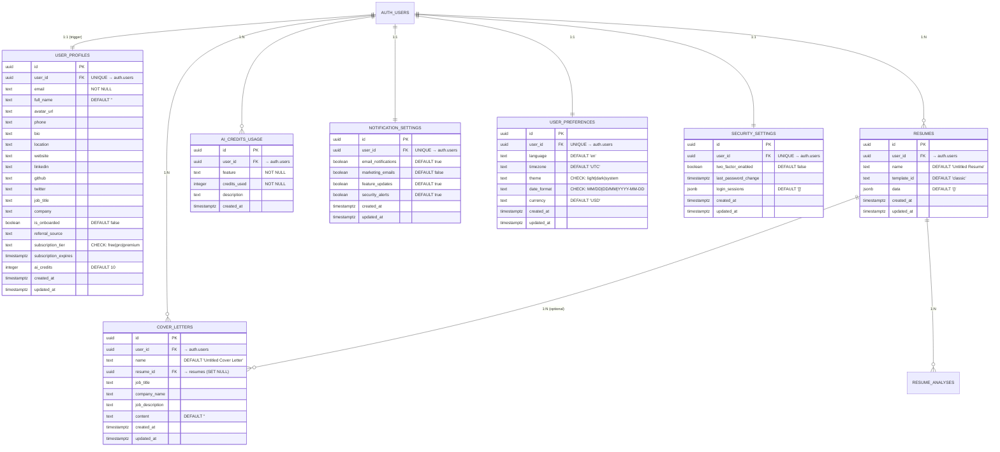

# Database Schema — Complete Reference

ApexResume uses **Supabase (PostgreSQL)** as its primary data store. The schema is designed for security (Row Level Security on every table), scalability (JSONB for flexible data), and atomic operations (stored procedures with row locks).

---

## Table of Contents
1. [Schema Overview (ER Diagram)](#1-schema-overview)
2. [user_profiles](#2-user_profiles)
3. [resumes](#3-resumes)
4. [cover_letters](#4-cover_letters)
5. [ai_credits_usage](#5-ai_credits_usage)
6. [notification_settings](#6-notification_settings)
7. [user_preferences](#7-user_preferences)
8. [security_settings](#8-security_settings)
9. [resume_analyses (optional)](#9-resume_analyses)
10. [Stored Procedures & Functions](#10-stored-procedures--functions)
11. [Triggers](#11-triggers)
12. [Storage Buckets](#12-storage-buckets)
13. [Indexes](#13-indexes)

---

## 1. Schema Overview



---

## 2. `user_profiles`

> Core user profile information linked 1:1 to Supabase Auth. Auto-created on signup via trigger.

| Column | Type | Constraints | Default | Description |
|--------|------|-------------|---------|-------------|
| `id` | `uuid` | PK | `gen_random_uuid()` | Primary key |
| `user_id` | `uuid` | FK → `auth.users`, UNIQUE | — | Link to Supabase Auth user |
| `email` | `text` | NOT NULL | — | User's email |
| `full_name` | `text` | NOT NULL | `''` | Display name |
| `avatar_url` | `text` | — | `null` | URL to avatar in Supabase Storage |
| `phone` | `text` | — | `null` | Phone number |
| `bio` | `text` | — | `null` | User biography |
| `location` | `text` | — | `null` | Geographic location |
| `website` | `text` | — | `null` | Personal website URL |
| `linkedin` | `text` | — | `null` | LinkedIn profile URL |
| `github` | `text` | — | `null` | GitHub profile URL |
| `twitter` | `text` | — | `null` | Twitter/X handle |
| `job_title` | `text` | — | `null` | Current job title |
| `company` | `text` | — | `null` | Current company |
| `is_onboarded` | `boolean` | — | `false` | Whether user completed onboarding |
| `referral_source` | `text` | — | `null` | How user discovered ApexResume |
| `subscription_tier` | `text` | CHECK | `'free'` | One of: `free`, `pro`, `premium` |
| `subscription_expires` | `timestamptz` | — | `null` | Subscription expiration date |
| `ai_credits` | `integer` | NOT NULL | `10` | Current AI credit balance |
| `created_at` | `timestamptz` | — | `now()` | Profile creation timestamp |
| `updated_at` | `timestamptz` | — | `now()` | Last update timestamp |

**RLS Policies**: Users can only SELECT, INSERT, UPDATE, DELETE their own rows (`auth.uid() = user_id`).

---

## 3. `resumes`

> Primary storage for user resume content. Data is stored as a flexible JSONB object.

| Column | Type | Constraints | Default | Description |
|--------|------|-------------|---------|-------------|
| `id` | `uuid` | PK | `gen_random_uuid()` | Resume identifier |
| `user_id` | `uuid` | FK → `auth.users`, NOT NULL | — | Resume owner |
| `name` | `text` | NOT NULL | `'Untitled Resume'` | User-defined title |
| `template_id` | `text` | — | `'classic'` | Template slug (classic, modern, creative, minimal, photo) |
| `data` | `jsonb` | NOT NULL | `'{}'` | Full resume content (see JSONB structure below) |
| `created_at` | `timestamptz` | — | `now()` | Creation timestamp |
| `updated_at` | `timestamptz` | — | `now()` | Last save timestamp |

**JSONB `data` Structure:**
```json
{
  "personalInfo": {
    "name": "John Doe",
    "title": "Software Engineer",
    "email": "john@example.com",
    "phone": "+1234567890",
    "location": "San Francisco, CA",
    "summary": "Experienced software engineer...",
    "linkedin": "https://linkedin.com/in/johndoe",
    "website": "https://johndoe.dev"
  },
  "experience": [
    {
      "id": "exp-uuid-1",
      "jobTitle": "Senior Engineer",
      "company": "TechCorp",
      "date": "2020 - Present",
      "startDate": "2020-01",
      "endDate": "",
      "location": "Remote",
      "responsibilities": "Led team of 8 engineers...",
      "achievements": ["Increased deployment frequency by 300%"]
    }
  ],
  "education": [
    {
      "id": "edu-uuid-1",
      "degree": "B.S. Computer Science",
      "school": "MIT",
      "date": "2016 - 2020",
      "location": "Cambridge, MA",
      "gpa": "3.8",
      "honors": ["Magna Cum Laude"],
      "relevantCourses": ["Machine Learning", "Distributed Systems"]
    }
  ],
  "skills": {
    "languages": "TypeScript, Python, Go",
    "frameworks": "React, Next.js, Node.js",
    "tools": "Docker, AWS, PostgreSQL",
    "other": "Agile, CI/CD, System Design",
    "technical": ["React", "TypeScript", "Node.js"],
    "soft": ["Leadership", "Communication"]
  },
  "projects": [
    {
      "id": "proj-uuid-1",
      "name": "ApexResume",
      "description": "AI-powered resume builder...",
      "technologies": "Next.js, Supabase, OpenAI",
      "date": "2024",
      "url": "https://apexresume.com",
      "github": "https://github.com/...",
      "highlights": ["10K+ users", "AI-powered"]
    }
  ],
  "references": [],
  "customSections": [
    {
      "id": "custom-uuid-1",
      "title": "Certifications",
      "content": "AWS Solutions Architect...",
      "type": "list"
    }
  ],
  "analysis": {
    "skillsAnalysis": [{ "name": "React", "proficiency": 90, "category": "Frontend" }],
    "jobMatches": [{ "title": "Senior Frontend Engineer", "matchPercentage": 92, "reasoning": "..." }],
    "summary": "Strong technical profile..."
  }
}
```

**RLS Policies**: Full owner-only access for all operations.

---

## 4. `cover_letters`

> AI-generated cover letters with optional link back to the source resume.

| Column | Type | Constraints | Default | Description |
|--------|------|-------------|---------|-------------|
| `id` | `uuid` | PK | `gen_random_uuid()` | Cover letter identifier |
| `user_id` | `uuid` | FK → `auth.users`, NOT NULL | — | Owner |
| `name` | `text` | NOT NULL | `'Untitled Cover Letter'` | User-defined title |
| `resume_id` | `uuid` | FK → `resumes` (ON DELETE SET NULL) | `null` | Source resume (optional) |
| `job_title` | `text` | — | `null` | Target job title |
| `company_name` | `text` | — | `null` | Target company |
| `job_description` | `text` | — | `null` | Full job description text |
| `content` | `text` | NOT NULL | `''` | Generated cover letter content |
| `created_at` | `timestamptz` | — | `now()` | Creation timestamp |
| `updated_at` | `timestamptz` | — | `now()` | Last update timestamp |

**Foreign Key Behavior**: If the linked resume is deleted, `resume_id` is set to `NULL` (not cascaded).

---

## 5. `ai_credits_usage`

> Audit trail for all AI credit transactions. Positive values = consumption, negative values = additions (purchases/bonuses).

| Column | Type | Constraints | Default | Description |
|--------|------|-------------|---------|-------------|
| `id` | `uuid` | PK | `gen_random_uuid()` | Transaction identifier |
| `user_id` | `uuid` | FK → `auth.users`, NOT NULL | — | User who used/received credits |
| `feature` | `text` | NOT NULL | — | AI feature name (see list below) |
| `credits_used` | `integer` | NOT NULL | — | Amount consumed (positive) or added (negative) |
| `description` | `text` | — | `null` | Human-readable description |
| `created_at` | `timestamptz` | — | `now()` | Transaction timestamp |

**Valid `feature` values:**
`resume_summary`, `resume_experience`, `resume_project`, `resume_analysis`, `ats_score`, `cover_letter_generation`, `cover_letter_improvement`, `resume_rewrite`, `job_match_analysis`, `interview_prep`, `purchase`, `bonus`, `refund`, `monthly_reset`

**RLS**: Users can SELECT and INSERT their own rows. Service role has full access for credit additions.

---

## 6. `notification_settings`

> Per-user notification preferences. Auto-created with defaults when first accessed.

| Column | Type | Constraints | Default | Description |
|--------|------|-------------|---------|-------------|
| `id` | `uuid` | PK | `gen_random_uuid()` | Record identifier |
| `user_id` | `uuid` | FK → `auth.users`, UNIQUE | — | User |
| `email_notifications` | `boolean` | NOT NULL | `true` | Receive email notifications |
| `marketing_emails` | `boolean` | NOT NULL | `false` | Receive marketing emails |
| `feature_updates` | `boolean` | NOT NULL | `true` | Receive feature update emails |
| `security_alerts` | `boolean` | NOT NULL | `true` | Receive security alert emails |
| `created_at` | `timestamptz` | — | `now()` | Creation timestamp |
| `updated_at` | `timestamptz` | — | `now()` | Last update timestamp |

---

## 7. `user_preferences`

> App-level preferences for internationalization and display.

| Column | Type | Constraints | Default | Description |
|--------|------|-------------|---------|-------------|
| `id` | `uuid` | PK | `gen_random_uuid()` | Record identifier |
| `user_id` | `uuid` | FK → `auth.users`, UNIQUE | — | User |
| `language` | `text` | NOT NULL | `'en'` | UI language |
| `timezone` | `text` | NOT NULL | `'UTC'` | User timezone |
| `theme` | `text` | CHECK | `'system'` | `light`, `dark`, or `system` |
| `date_format` | `text` | CHECK | `'MM/DD/YYYY'` | `MM/DD/YYYY`, `DD/MM/YYYY`, or `YYYY-MM-DD` |
| `currency` | `text` | NOT NULL | `'USD'` | Preferred currency |
| `created_at` | `timestamptz` | — | `now()` | Creation timestamp |
| `updated_at` | `timestamptz` | — | `now()` | Last update timestamp |

---

## 8. `security_settings`

> User security configuration and login session tracking.

| Column | Type | Constraints | Default | Description |
|--------|------|-------------|---------|-------------|
| `id` | `uuid` | PK | `gen_random_uuid()` | Record identifier |
| `user_id` | `uuid` | FK → `auth.users`, UNIQUE | — | User |
| `two_factor_enabled` | `boolean` | NOT NULL | `false` | 2FA status |
| `last_password_change` | `timestamptz` | — | `null` | Last password change date |
| `login_sessions` | `jsonb` | NOT NULL | `'[]'` | Array of login session objects |
| `created_at` | `timestamptz` | — | `now()` | Creation timestamp |
| `updated_at` | `timestamptz` | — | `now()` | Last update timestamp |

**`login_sessions` JSONB structure:**
```json
[
  {
    "id": "session-uuid",
    "device": "Windows 11",
    "browser": "Chrome 120",
    "location": "San Francisco, CA",
    "last_active": "2024-01-15T10:30:00Z",
    "is_current": true
  }
]
```

---

## 9. `resume_analyses` (Optional)

> Persisted AI analysis results. Uses upsert pattern with composite unique key on `(resume_id, analysis_type)`.

| Column | Type | Constraints | Default | Description |
|--------|------|-------------|---------|-------------|
| `id` | `uuid` | PK | `gen_random_uuid()` | Analysis identifier |
| `user_id` | `uuid` | FK → `auth.users` | — | Owner |
| `resume_id` | `uuid` | FK → `resumes` | — | Analyzed resume |
| `analysis_type` | `text` | — | `'full_analysis'` | `full_analysis` or `skill_job_match` |
| `analysis_data` | `jsonb` | — | — | Full analysis results |
| `overall_score` | `integer` | — | `null` | 0-100 overall score |
| `is_fallback` | `boolean` | — | `false` | Whether fallback data was used |
| `created_at` | `timestamptz` | — | `now()` | Creation timestamp |
| `updated_at` | `timestamptz` | — | `now()` | Last update timestamp |

**Unique constraint**: `(resume_id, analysis_type)` — enables upsert behavior.

---

## 10. Stored Procedures & Functions

### `deduct_credits(p_user_id, p_feature, p_credits, p_description)`

Atomically deducts credits from a user's balance. Uses `FOR UPDATE` row-level locking to prevent race conditions.

```
Input:  user_id (uuid), feature (text), credits (int), description (text)
Output: TABLE(success boolean, new_balance integer, error_message text)

Flow:
  1. Lock user_profiles row → FOR UPDATE
  2. Check if credits >= required
  3. If insufficient → return (false, current_balance, 'Insufficient credits')
  4. Deduct credits → UPDATE user_profiles
  5. Log transaction → INSERT ai_credits_usage
  6. Return (true, new_balance, null)
```

### `add_credits(p_user_id, p_credits, p_feature, p_description)`

Adds credits to a user's balance with tier-aware maximum caps.

```
Input:  user_id (uuid), credits (int), feature (text), description (text)
Output: TABLE(success boolean, new_balance integer)

Caps:
  free    → max 10 credits
  pro     → max 200 credits
  premium → max 1000 credits
```

### `get_monthly_credit_usage(p_user_id)`

Returns usage statistics for the current calendar month.

```
Input:  user_id (uuid)
Output: TABLE(total_used integer, transaction_count integer, by_feature jsonb)
```

### `handle_new_user()` (Trigger Function)

Auto-creates a `user_profiles` row when a new user signs up via Supabase Auth.

---

## 11. Triggers

| Trigger | Event | Table | Function |
|---------|-------|-------|----------|
| `on_auth_user_created` | AFTER INSERT | `auth.users` | `handle_new_user()` |

This ensures every authenticated user automatically gets a profile with 10 free AI credits.

---

## 12. Storage Buckets

### `avatars` Bucket

| Setting | Value |
|---------|-------|
| **Public** | Yes (publicly accessible URLs) |
| **Max File Size** | 5 MB |
| **Allowed MIME Types** | `image/jpeg`, `image/png`, `image/gif`, `image/webp` |

**Storage Policies:**
- **SELECT**: All avatars are publicly accessible
- **INSERT**: Users can upload to their own folder (`/avatars/{user_id}/`)
- **UPDATE**: Users can update their own avatar
- **DELETE**: Users can delete their own avatar

---

## 13. Indexes

| Table | Index | Columns | Purpose |
|-------|-------|---------|---------|
| `user_profiles` | `user_profiles_user_id_idx` | `user_id` | Fast lookup by auth user |
| `user_profiles` | `user_profiles_email_idx` | `email` | Email lookups |
| `resumes` | `resumes_user_id_idx` | `user_id` | List user's resumes |
| `resumes` | `resumes_updated_at_idx` | `updated_at DESC` | Recent-first ordering |
| `cover_letters` | `cover_letters_user_id_idx` | `user_id` | List user's cover letters |
| `cover_letters` | `cover_letters_updated_at_idx` | `updated_at DESC` | Recent-first ordering |
| `ai_credits_usage` | `ai_credits_usage_user_id_idx` | `user_id` | User's transactions |
| `ai_credits_usage` | `ai_credits_usage_created_at_idx` | `created_at DESC` | Chronological order |
| `ai_credits_usage` | `ai_credits_usage_feature_idx` | `feature` | Feature-based analytics |
| `ai_credits_usage` | `ai_credits_usage_user_created_idx` | `user_id, created_at DESC` | Composite for monthly queries |
| `notification_settings` | `notification_settings_user_id_idx` | `user_id` | User lookup |
| `user_preferences` | `user_preferences_user_id_idx` | `user_id` | User lookup |
| `security_settings` | `security_settings_user_id_idx` | `user_id` | User lookup |

---

## SQL Scripts Reference

All database scripts are located in `scripts/`:

| Script | Purpose |
|--------|---------|
| `complete-database-schema.sql` | **Master script** — creates all tables, RLS, functions, triggers, storage |
| `create-user-profiles-table.sql` | Standalone user_profiles table creation |
| `create-resumes-table.sql` | Standalone resumes table creation |
| `create-cover-letters-table.sql` | Standalone cover letters table creation |
| `create-ai-credits-usage-table.sql` | Credits usage table with functions |
| `create-user-preferences-table.sql` | User preferences table |
| `create-security-settings-table.sql` | Security settings table |
| `create-avatar-storage.sql` | Storage bucket + policies |
| `add-is-onboarded-column.sql` | Migration: add `is_onboarded` column |
| `add-referral-source-column.sql` | Migration: add `referral_source` column |
| `update-user-profiles-table.sql` | Migration: update user profiles schema |
