# Data Flow & Sequence Diagrams

This document provides visual and textual explanations for how data flows through ApexResume for every major feature. Each flow includes a Mermaid sequence diagram and step-by-step textual breakdown.

---

## Table of Contents

1. [Authentication Flow](#1-authentication-flow)
2. [Resume CRUD Flow](#2-resume-crud-flow)
3. [Resume Editing (Auto-Save)](#3-resume-editing-auto-save)
4. [AI Content Generation](#4-ai-content-generation)
5. [Resume Analysis Flow](#5-resume-analysis-flow)
6. [Cover Letter Generation](#6-cover-letter-generation)
7. [PDF Export Flow](#7-pdf-export-flow)
8. [Credit Consumption Flow](#8-credit-consumption-flow)
9. [Credit Purchase Flow (Stripe)](#9-credit-purchase-flow)
10. [Profile & Avatar Upload](#10-profile--avatar-upload)
11. [Onboarding Flow](#11-onboarding-flow)
12. [Resume File Upload (Parse)](#12-resume-file-upload--parse)

---

## 1. Authentication Flow

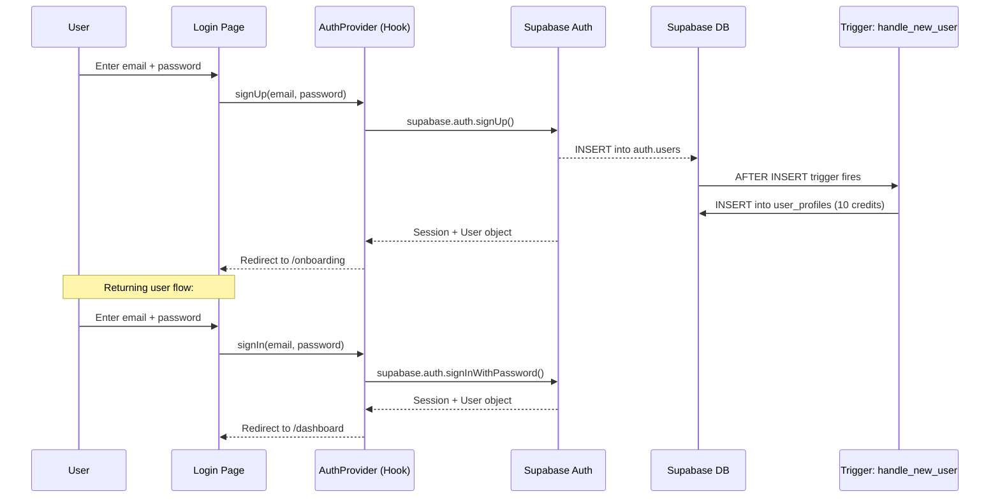

**Key details:**
- New users are auto-redirected to `/onboarding` (checked via `is_onboarded` flag)
- The `handle_new_user` trigger automatically creates a `user_profiles` row with 10 free credits
- Sessions are managed by Supabase Auth (JWT-based)
- `AuthProvider` hook exposes: `user`, `session`, `loading`, `signIn()`, `signOut()`, `signUp()`

---

## 2. Resume CRUD Flow

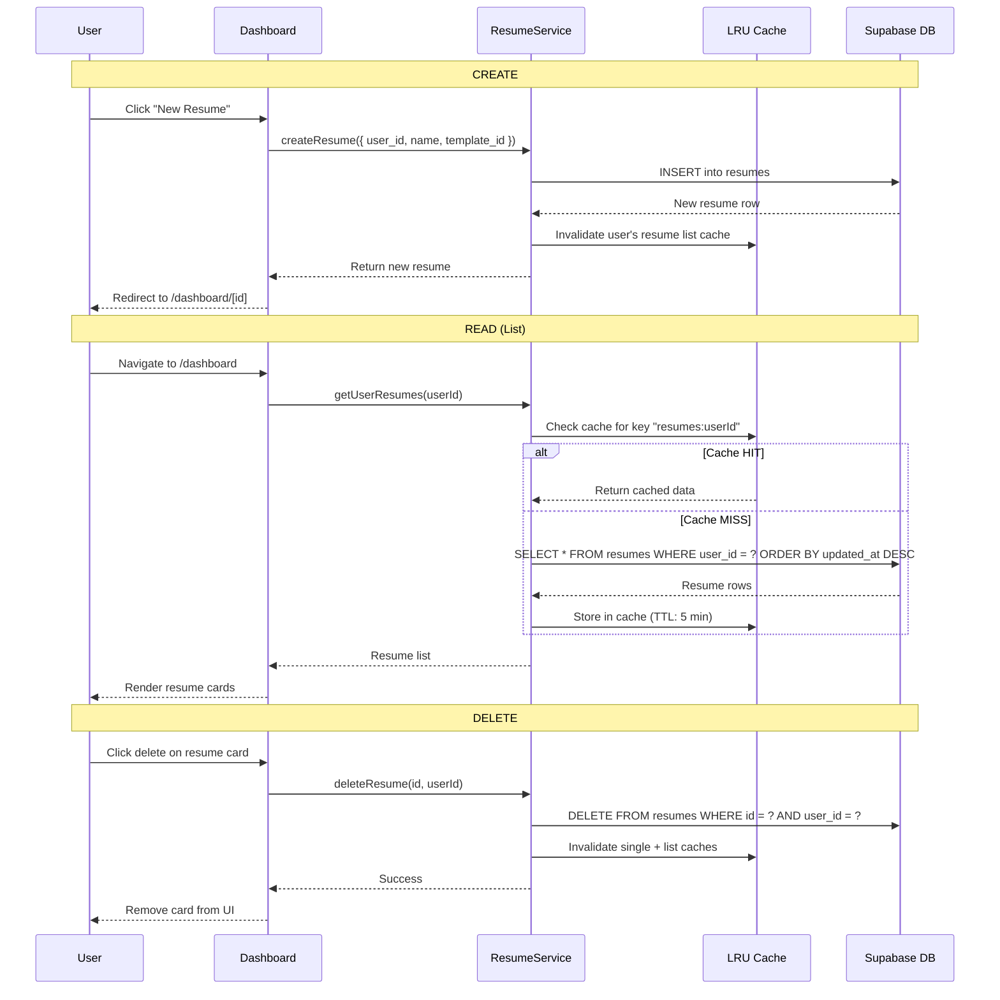

---

## 3. Resume Editing (Auto-Save)

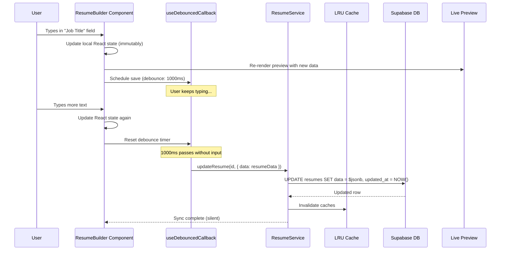

**Key details:**
- The `ResumeBuilder` component (75KB) is the centerpiece — manages the full `ResumeData` state
- `updateSection` handler ensures immutable updates for deeply nested JSON objects
- Debounce interval: 1000ms — prevents excessive database writes
- Live preview re-renders instantly from local state (no DB round-trip)
- Drag & drop via `@dnd-kit` triggers the same save pipeline

---

## 4. AI Content Generation

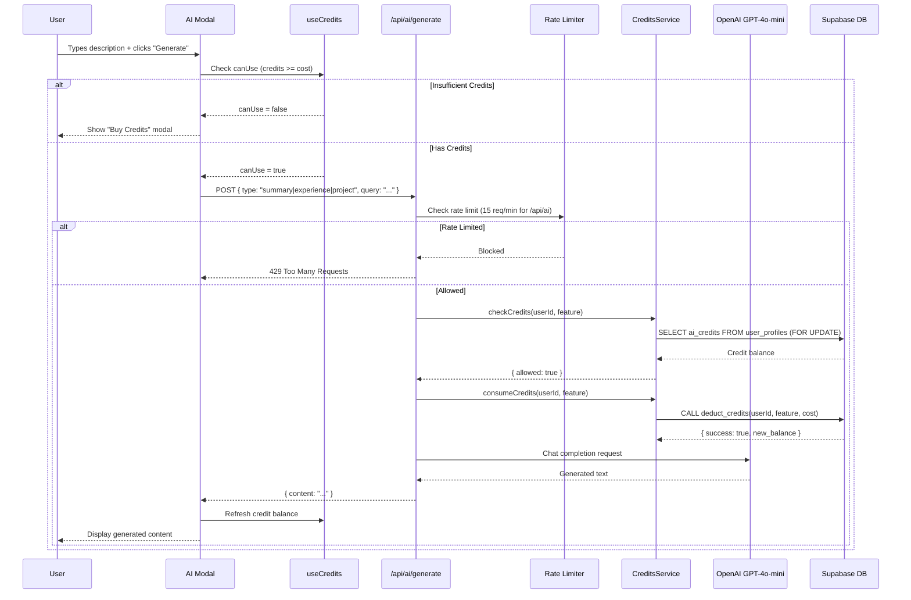

**Supported generation types:**
| Type | Prompt Strategy | Output |
|------|----------------|--------|
| `summary` | 2-3 sentence professional summary | Paragraph |
| `experience` | 3-4 action-verb bullet points | `•` formatted list |
| `project` | 2-3 sentence project description | Paragraph |

---

## 5. Resume Analysis Flow

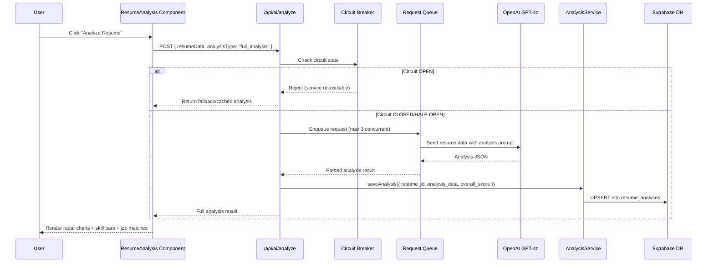

**Analysis output includes:**
- **Skill proficiency scores** (0-100 per skill, by category)
- **Job match percentages** (top matching roles with reasoning)
- **Overall resume score** (0-100)
- **Actionable improvements** (categorized as Strengths / Improvements)

---

## 6. Cover Letter Generation

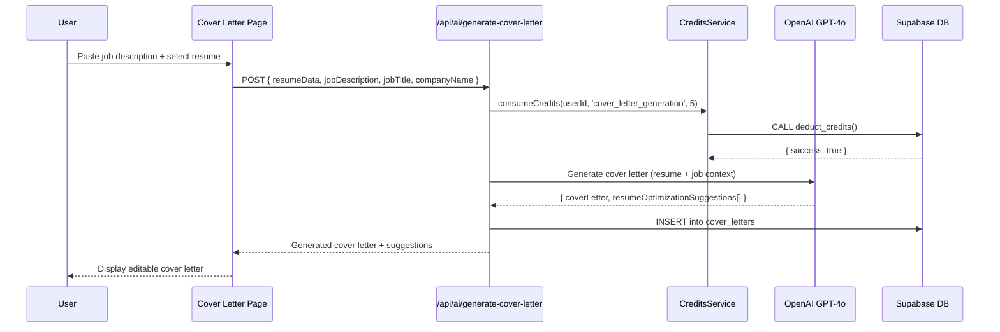

**Cost: 5 credits** for generation, **3 credits** for improvement of existing letter.

---

## 7. PDF Export Flow

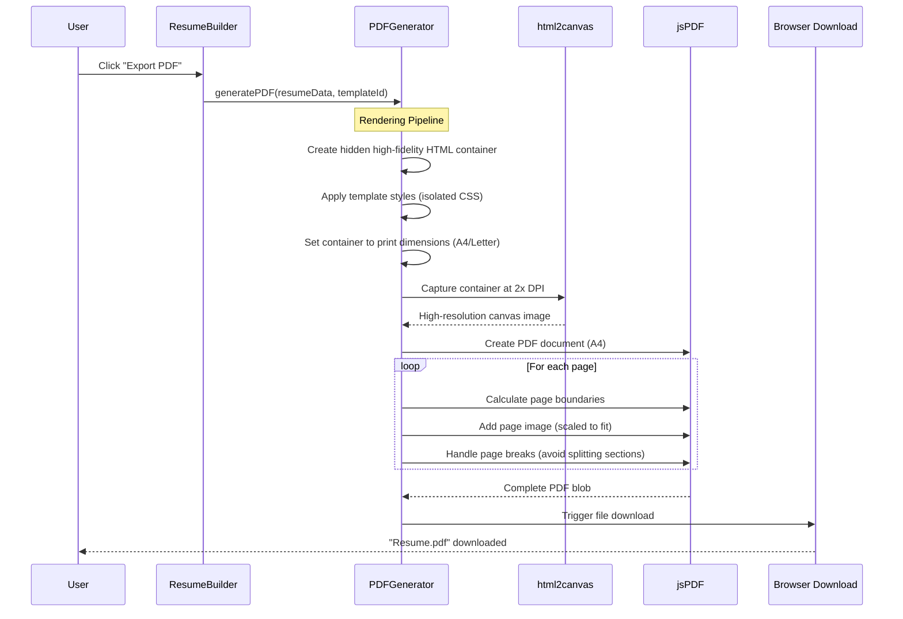

**Key details:**
- **Entirely client-side** — no data sent to server
- **High DPI**: Rendered at 2x resolution for print quality
- **Page break handling**: Smart detection to avoid splitting work experience entries
- **Three generator strategies** for reliability:
  1. `pdf-generator.ts` — Primary (html2canvas + jsPDF)
  2. `html-pdf-generator.ts` — HTML-based with exact rendering
  3. `simple-pdf-generator.ts` — Simplified fallback
- **ATS Export**: `ats-resume-exporter/` provides plain-text optimized output

---

## 8. Credit Consumption Flow

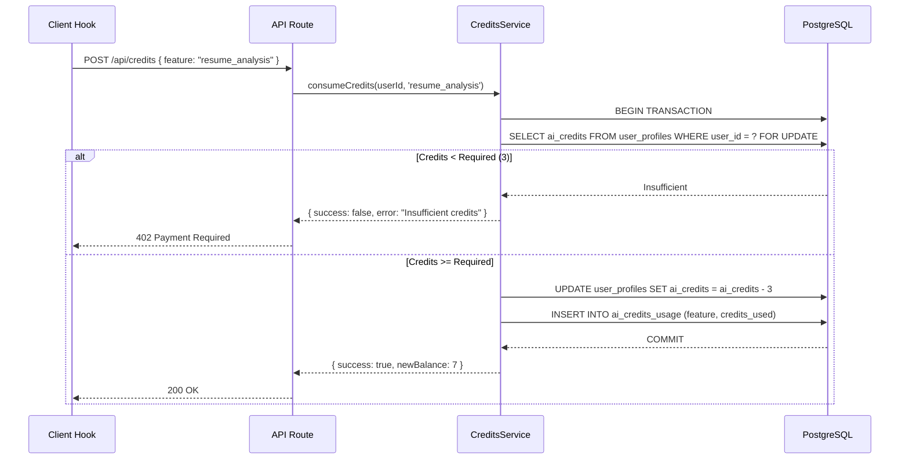

**Atomicity guarantee**: The `deduct_credits` PL/pgSQL function uses `FOR UPDATE` row locking, preventing double-spending in concurrent requests.

---

## 9. Credit Purchase Flow

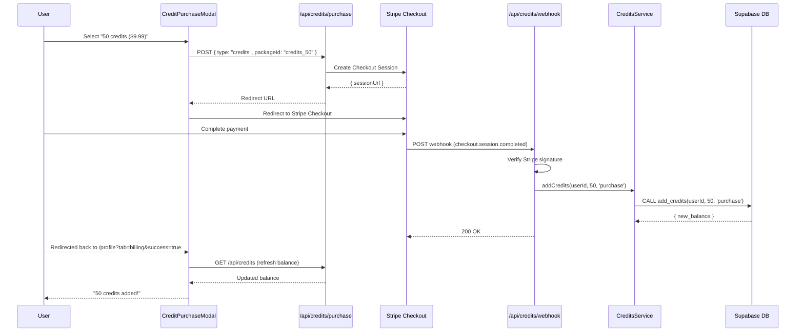

---

## 10. Profile & Avatar Upload

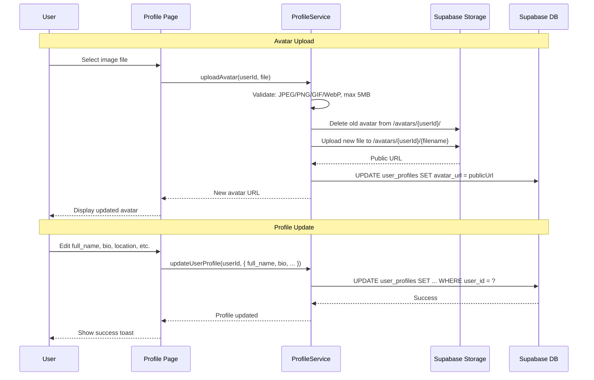

---

## 11. Onboarding Flow

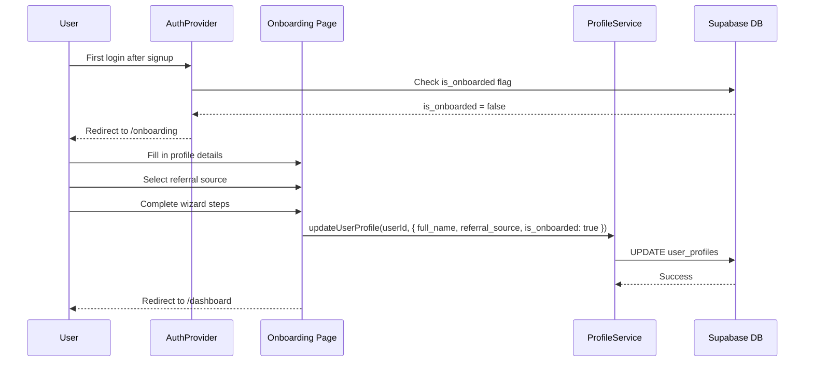

---

## 12. Resume File Upload & Parse

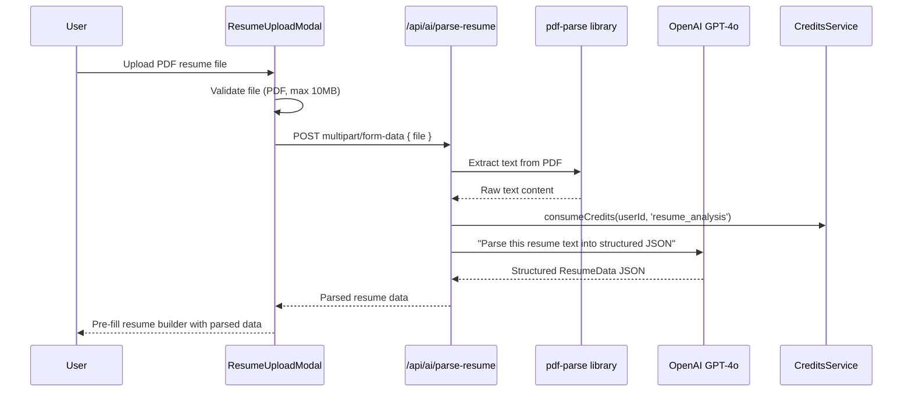

**Supported formats:** PDF (via `pdf-parse` library)
