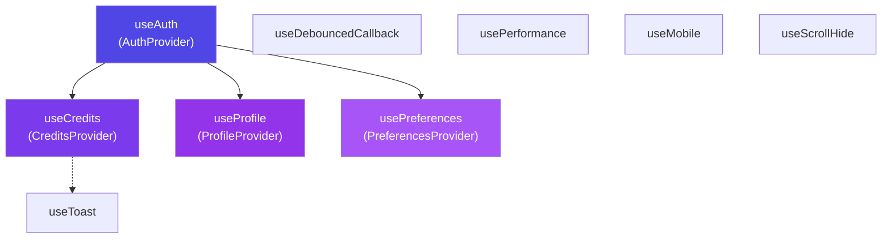

# Custom Hooks Reference

ApexResume uses 9 custom React hooks for state management, side effects, and UI behavior. Each hook is documented with its signature, return values, and usage examples.

---

## Table of Contents

1. [useAuth](#1-useauth)
2. [useCredits](#2-usecredits)
3. [useProfile](#3-useprofile)
4. [usePreferences](#4-usepreferences)
5. [useDebouncedCallback](#5-usedebouncedcallback)
6. [usePerformance](#6-useperformance)
7. [useMobile](#7-usemobile)
8. [useScrollHide](#8-usescrollhide)
9. [useToast](#9-usetoast)

---

## 1. `useAuth`

**File:** `hooks/use-auth.tsx` (4.5KB)
**Type:** Context Provider + Hook
**Purpose:** Manages Supabase authentication state across the entire app.

### Provider

Wraps the app in `app/layout.tsx` as `<AuthProvider>`.

### Return Value

```typescript
interface AuthContextValue {
  user: User | null              // Supabase Auth user object
  session: Session | null        // Active session (JWT, tokens)
  loading: boolean               // True during initial auth check
  signIn: (email: string, password: string) => Promise<AuthResult>
  signUp: (email: string, password: string, metadata?: object) => Promise<AuthResult>
  signOut: () => Promise<void>
  signInWithGoogle: () => Promise<void>
  signInWithGitHub: () => Promise<void>
  resetPassword: (email: string) => Promise<void>
  updatePassword: (newPassword: string) => Promise<void>
}
```

### Usage

```tsx
import { useAuth } from '@/hooks/use-auth'

function DashboardPage() {
  const { user, loading, signOut } = useAuth()

  if (loading) return <Loading />
  if (!user) redirect('/login')

  return (
    <div>
      <p>Welcome, {user.email}</p>
      <button onClick={signOut}>Sign Out</button>
    </div>
  )
}
```

### Key Behaviors

- Listens to `onAuthStateChange` for real-time session updates
- Automatically redirects unauthenticated users on protected routes
- Persists session across page refreshes (Supabase handles cookies)
- Extracts `user_metadata` (full_name, avatar_url) from OAuth providers

---

## 2. `useCredits`

**File:** `hooks/use-credits.tsx` (9.4KB)
**Type:** Context Provider + Hook + `useAIFeature` helper
**Purpose:** Manages the AI credit economy — balance, consumption, and purchase flows.

### Provider

Wraps the app in `app/layout.tsx` as `<CreditsProvider>`.

### Return Values

#### `useCredits()`

```typescript
interface CreditsContextValue {
  balance: CreditBalance | null  // Current balance, monthly usage, tier info
  loading: boolean               // Loading state
  error: string | null           // Error message
  refreshBalance: () => Promise<void>  // Re-fetch balance
  useCredit: (feature: AIFeature, description?: string) => Promise<CreditUseResult>
  purchaseCredits: (packageId: string) => Promise<string | null>  // Returns checkout URL
  getFeatureCost: (feature: AIFeature) => number  // Get credit cost
  canAfford: (feature: AIFeature) => boolean  // Quick check
  tiers: typeof SUBSCRIPTION_TIERS
  packages: typeof CREDIT_PACKAGES
}
```

#### `useAIFeature(feature)`

Simplified hook for a single AI feature:

```typescript
interface AIFeatureHook {
  canUse: boolean        // Has enough credits
  cost: number           // Credits required
  balance: number        // Current balance
  loading: boolean       // Operation in progress
  execute: <T>(fn: () => Promise<T>) => Promise<{ success: boolean; result?: T; error?: string }>
}
```

### Usage

```tsx
import { useCredits, useAIFeature } from '@/hooks/use-credits'

// Simple: Single feature
function GenerateButton() {
  const aiFeature = useAIFeature('resume_summary')

  return (
    <button
      disabled={!aiFeature.canUse}
      onClick={async () => {
        const result = await aiFeature.execute(async () => {
          return await generateSummary(prompt)
        })
        if (result.success) {
          // Handle result.result
        }
      }}
    >
      Generate ({aiFeature.cost} credits)
    </button>
  )
}

// Full: Balance + purchase
function BillingPage() {
  const { balance, packages, purchaseCredits } = useCredits()

  return (
    <div>
      <p>Credits: {balance?.current} / {balance?.monthly_limit}</p>
      {packages.map(pkg => (
        <button key={pkg.id} onClick={() => purchaseCredits(pkg.id)}>
          Buy {pkg.credits} credits for ${pkg.price}
        </button>
      ))}
    </div>
  )
}
```

---

## 3. `useProfile`

**File:** `hooks/use-profile.tsx` (2.0KB)
**Type:** Context Provider + Hook
**Purpose:** Provides user profile data (full_name, avatar_url, etc.) across the app.

### Provider

Wraps the app as `<ProfileProvider>`.

### Return Value

```typescript
interface ProfileContextValue {
  profile: UserProfile | null   // Full profile data
  loading: boolean              // Loading state
  refreshProfile: () => Promise<void>  // Re-fetch
}
```

### Usage

```tsx
import { useProfile } from '@/hooks/use-profile'

function Header() {
  const { profile } = useProfile()

  return (
    <div>
      
      <span>{profile?.full_name || 'User'}</span>
    </div>
  )
}
```

---

## 4. `usePreferences`

**File:** `hooks/use-preferences.tsx` (4.6KB)
**Type:** Context Provider + Hook
**Purpose:** Manages user app preferences (theme, language, timezone, date format, currency).

### Provider

Wraps the app as `<PreferencesProvider>`.

### Return Value

```typescript
interface PreferencesContextValue {
  preferences: UserPreferences | null
  loading: boolean
  updatePreference: (key: keyof UserPreferences, value: any) => Promise<void>
  formatDate: (date: string | Date) => string  // Format using user's date_format
  formatCurrency: (amount: number) => string    // Format using user's currency
}

interface UserPreferences {
  language: string                                    // 'en', 'fr', 'es', etc.
  timezone: string                                    // 'UTC', 'America/New_York', etc.
  theme: 'light' | 'dark' | 'system'                 // App theme
  date_format: 'MM/DD/YYYY' | 'DD/MM/YYYY' | 'YYYY-MM-DD'
  currency: string                                    // 'USD', 'EUR', 'GBP', etc.
}
```

### Usage

```tsx
import { usePreferences } from '@/hooks/use-preferences'

function SettingsPage() {
  const { preferences, updatePreference, formatDate } = usePreferences()

  return (
    <div>
      <select
        value={preferences?.theme}
        onChange={(e) => updatePreference('theme', e.target.value)}
      >
        <option value="light">Light</option>
        <option value="dark">Dark</option>
        <option value="system">System</option>
      </select>

      <p>Last login: {formatDate(lastLoginDate)}</p>
    </div>
  )
}
```

---

## 5. `useDebouncedCallback`

**File:** `hooks/use-debounced-callback.ts` (4.6KB)
**Type:** Standalone Hook
**Purpose:** Debounces callback functions to prevent excessive operations. Critical for the auto-save feature in the resume editor.

### Signature

```typescript
function useDebouncedCallback<T extends (...args: any[]) => any>(
  callback: T,
  delay: number,
  options?: {
    leading?: boolean     // Fire on the leading edge (default: false)
    trailing?: boolean    // Fire on the trailing edge (default: true)
    maxWait?: number      // Maximum time to wait before forced execution
  }
): {
  debouncedFn: (...args: Parameters<T>) => void
  cancel: () => void       // Cancel pending execution
  flush: () => void        // Immediately execute pending call
  isPending: () => boolean // Check if there's a pending call
}
```

### Usage

```tsx
import { useDebouncedCallback } from '@/hooks/use-debounced-callback'

function ResumeEditor() {
  const { debouncedFn: saveResume } = useDebouncedCallback(
    async (data: ResumeData) => {
      await ResumeService.updateResume(resumeId, { data })
    },
    1000  // 1 second debounce
  )

  const handleChange = (field: string, value: string) => {
    setResumeData(prev => ({ ...prev, [field]: value }))
    saveResume(resumeData)  // Auto-save after 1s of inactivity
  }
}
```

---

## 6. `usePerformance`

**File:** `hooks/use-performance.tsx` (7.5KB)
**Type:** Standalone Hook
**Purpose:** Client-side performance monitoring and metrics collection.

### Return Value

```typescript
interface PerformanceMetrics {
  pageLoadTime: number | null        // Total page load time (ms)
  domContentLoaded: number | null    // DOM content loaded time (ms)
  firstContentfulPaint: number | null // FCP (ms)
  largestContentfulPaint: number | null // LCP (ms)
  timeToInteractive: number | null   // TTI (ms)
  memoryUsage: {
    usedJSHeapSize: number
    totalJSHeapSize: number
    jsHeapSizeLimit: number
  } | null
}

function usePerformance(): {
  metrics: PerformanceMetrics
  measureOperation: (name: string, fn: () => Promise<any>) => Promise<any>
  getOperationStats: (name: string) => { avg: number; min: number; max: number; count: number }
}
```

### Usage

```tsx
import { usePerformance } from '@/hooks/use-performance'

function DashboardPage() {
  const { metrics, measureOperation } = usePerformance()

  useEffect(() => {
    measureOperation('load_resumes', async () => {
      return await ResumeService.getUserResumes(userId)
    })
  }, [])

  if (process.env.NODE_ENV === 'development') {
    console.log('LCP:', metrics.largestContentfulPaint, 'ms')
  }
}
```

---

## 7. `useMobile`

**File:** `hooks/use-mobile.tsx` (946 bytes)
**Type:** Standalone Hook
**Purpose:** Detects if the viewport matches a mobile breakpoint.

### Signature

```typescript
function useMobile(breakpoint?: number): boolean
// Default breakpoint: 768px
```

### Usage

```tsx
import { useMobile } from '@/hooks/use-mobile'

function Navigation() {
  const isMobile = useMobile()

  return isMobile ? <MobileMenu /> : <DesktopNav />
}
```

---

## 8. `useScrollHide`

**File:** `hooks/use-scroll-hide.tsx` (1.5KB)
**Type:** Standalone Hook
**Purpose:** Auto-hides/shows an element (typically navigation) based on scroll direction.

### Signature

```typescript
function useScrollHide(options?: {
  threshold?: number    // Scroll amount before toggle (default: 50px)
  initialVisible?: boolean  // Initial visibility (default: true)
}): {
  isVisible: boolean    // Whether the element should be shown
  scrollY: number       // Current scroll position
}
```

### Usage

```tsx
import { useScrollHide } from '@/hooks/use-scroll-hide'

function StickyHeader() {
  const { isVisible } = useScrollHide({ threshold: 100 })

  return (
    <header className={`sticky-header ${isVisible ? 'visible' : 'hidden'}`}>
      <Navigation />
    </header>
  )
}
```

**Behavior:**
- Scrolling **down** → header hides
- Scrolling **up** → header shows
- Threshold prevents flickering on small scrolls

---

## 9. `useToast`

**File:** `hooks/use-toast.ts` (4.1KB)
**Type:** Standalone Hook
**Purpose:** Manages toast notifications using the sonner library.

### Return Value

```typescript
function useToast(): {
  toast: (options: ToastOptions) => string       // Show toast, returns ID
  dismiss: (toastId?: string) => void            // Dismiss specific or all
  toasts: ToastState[]                           // Current toast state
}

interface ToastOptions {
  title?: string
  description?: string
  variant?: 'default' | 'destructive'
  action?: React.ReactNode            // Action button
  duration?: number                    // Auto-dismiss time (ms)
}
```

### Usage

```tsx
import { useToast } from '@/hooks/use-toast'

function SaveButton() {
  const { toast } = useToast()

  const handleSave = async () => {
    try {
      await saveData()
      toast({
        title: "Saved!",
        description: "Your resume has been saved successfully.",
      })
    } catch {
      toast({
        title: "Error",
        description: "Failed to save. Please try again.",
        variant: "destructive",
      })
    }
  }
}
```

---

## Hook Dependencies Map



**Provider nesting order (root → leaf):**
```
ThemeProvider → AuthProvider → PreferencesProvider → CreditsProvider → ProfileProvider
```

Each provider depends on `AuthProvider` for the `user.id` to fetch its data.
