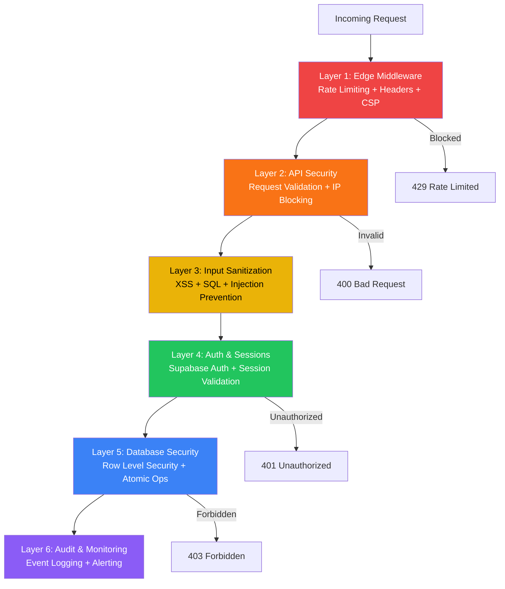

# Security Deep Dive

Comprehensive documentation of ApexResume's multi-layered security architecture — from edge middleware to database-level Row Level Security.

---

## Table of Contents

1. [Security Architecture Overview](#1-security-architecture-overview)
2. [Layer 1: Edge Middleware](#2-layer-1-edge-middleware)
3. [Layer 2: API Security](#3-layer-2-api-security)
4. [Layer 3: Input Sanitization](#4-layer-3-input-sanitization)
5. [Layer 4: Authentication & Sessions](#5-layer-4-authentication--sessions)
6. [Layer 5: Database Security (RLS)](#6-layer-5-database-security)
7. [Layer 6: File Upload Security](#7-layer-6-file-upload-security)
8. [Security Headers](#8-security-headers)
9. [Content Security Policy](#9-content-security-policy)
10. [CSRF Protection](#10-csrf-protection)
11. [Security Audit & Monitoring](#11-security-audit--monitoring)
12. [Security Configuration](#12-security-configuration)
13. [Emergency Procedures](#13-emergency-procedures)

---

## 1. Security Architecture Overview



---

## 2. Layer 1: Edge Middleware

**File:** `middleware.ts` (344 lines)
**Runtime:** Vercel Edge (globally distributed)

The first line of defense. Runs on **every request** before reaching any page or API route.

### Features

| Feature | Implementation |
|---------|---------------|
| **IP Blocking** | `Set<string>` of blocked IPs, checked on every request |
| **Header Validation** | Rejects requests without user-agent, blocks known attack tools (sqlmap, nikto, scanner) |
| **Burst Protection** | Max 20 requests in 5 seconds per IP |
| **Sliding Window Rate Limiting** | Path-specific limits with 1-minute windows |
| **Security Headers** | Injects 9 security headers on every response |
| **CSP** | Dynamic Content Security Policy header generation |
| **Auto-Cleanup** | Memory management with periodic cleanup of stale rate limit entries |

### Rate Limit Configuration

```typescript
const SECURITY_CONFIG = {
  rateLimitWindow: 60 * 1000,        // 1 minute
  maxRequestsPerWindow: 120,          // General
  maxRequestsPerWindowAPI: 60,        // API routes
  maxRequestsPerWindowAI: 15,         // AI routes
  burstLimit: 20,                     // Max in 5 seconds
  burstWindow: 5 * 1000,
  pathLimits: new Map([
    ['/api/ai/', 15],
    ['/api/auth/', 20],
    ['/api/', 60],
  ])
}
```

### Excluded Paths

Static assets are excluded from middleware for performance:
```regex
/((?!_next/static|_next/image|favicon.ico|manifest.json|.*\.(?:svg|png|jpg|jpeg|gif|webp)$).*)
```

---

## 3. Layer 2: API Security

**File:** `lib/api-security.ts` (11KB)

Specialized security for API routes, providing deeper request validation than the middleware.

### Components

| Class | Purpose |
|-------|---------|
| `APISecurityMiddleware` | Validates request headers, body size, content type, and IP |
| `APIRateLimit` | API-specific rate limiting (more granular than middleware) |
| `AuthSecurity` | Tracks authentication failures, auto-blocks after 5 violations |
| `FileUploadSecurity` | Validates uploaded files (type, size, extension, dangerous patterns) |

### Usage in API Routes

```typescript
import { APISecurityMiddleware, APIRateLimit } from '@/lib/api-security'

export async function POST(request: NextRequest) {
  // Step 1: Validate request
  const validation = await APISecurityMiddleware.validateRequest(request)
  if (!validation.isValid) {
    return NextResponse.json({ error: 'Invalid request' }, { status: 400 })
  }

  // Step 2: Check rate limits
  const rateLimit = APIRateLimit.check(validation.context.ip)
  if (!rateLimit.allowed) {
    return NextResponse.json({ error: 'Rate limit exceeded' }, { status: 429 })
  }

  // Step 3: Validate payload
  const payload = await APISecurityMiddleware.validateJSONPayload(request)
  if (!payload.isValid) {
    return NextResponse.json({ error: 'Invalid payload' }, { status: 400 })
  }

  // Proceed with business logic...
}
```

---

## 4. Layer 3: Input Sanitization

**File:** `lib/security.ts` (640 lines, 19KB)

Production-grade sanitization functions for every type of user input.

### Sanitization Functions

| Function | Input | Output | Protects Against |
|----------|-------|--------|-----------------|
| `sanitizeHtml(html)` | Raw HTML | Cleaned HTML | XSS via script tags, event handlers |
| `sanitizeText(text)` | Raw text | Clean text | HTML injection, script injection |
| `sanitizeEmail(email)` | Email string | Validated email or `null` | Invalid format, injection |
| `sanitizePhone(phone)` | Phone string | Cleaned digits | Format attacks |
| `sanitizeUrl(url)` | URL string | Validated URL or `null` | `javascript:`, `data:` protocols |
| `escapeSqlChars(input)` | Raw string | SQL-safe string | SQL injection |
| `generateSecureToken(length)` | Length | Random hex string | Weak tokens |

### HTML Sanitization Details

```typescript
sanitizeHtml("<script>alert('xss')</script><p>Hello</p>")
// Returns: "<p>Hello</p>"

sanitizeHtml('<div onclick="steal()">Click</div>')
// Returns: "Click" (div stripped, handler removed)

sanitizeHtml('')
// Returns: '' (javascript: protocol removed)
```

**Allowed HTML tags:** `p`, `br`, `strong`, `em`, `u`, `ul`, `ol`, `li`, `h1`-`h6`, `span`

---

## 5. Layer 4: Authentication & Sessions

### Supabase Auth

Authentication is handled by Supabase Auth with JWT-based sessions.

| Feature | Implementation |
|---------|---------------|
| **Email/Password** | Native Supabase Auth with email verification |
| **Social Login** | Google, GitHub via OAuth |
| **Session Management** | JWT tokens stored in HTTP-only cookies |
| **Password Reset** | Native Supabase email flow |

### Session Security Class

**File:** `lib/security.ts` — `SessionSecurity` class

```typescript
class SessionSecurity {
  static createSession(sessionId, ip, userAgent)    // Register new session
  static validateSession(sessionId, ip, userAgent)  // Validate + detect hijacking
  static invalidateSession(sessionId)               // Force logout
  static cleanupInactiveSessions(maxInactiveMs)     // Clean stale sessions
}
```

**Anti-hijacking:** Sessions are validated against both IP and User-Agent. If either changes, the session is automatically invalidated.

### IP Security Class

```typescript
class IPSecurity {
  static blockIP(ip, reason)                    // Block an IP
  static unblockIP(ip)                          // Unblock an IP
  static isBlocked(ip)                          // Check block status
  static reportSuspiciousActivity(ip, violation) // Report activity
  // Auto-blocks after 5 violations within 1 hour
}
```

---

## 6. Layer 5: Database Security

### Row Level Security (RLS)

**Every table** has RLS enabled with policies ensuring users can only access their own data:

```sql
-- Example: user_profiles policies
CREATE POLICY "Users can view own profile" ON user_profiles
  FOR SELECT USING (auth.uid() = user_id);

CREATE POLICY "Users can update own profile" ON user_profiles
  FOR UPDATE USING (auth.uid() = user_id);

CREATE POLICY "Users can insert own profile" ON user_profiles
  FOR INSERT WITH CHECK (auth.uid() = user_id);

CREATE POLICY "Users can delete own profile" ON user_profiles
  FOR DELETE USING (auth.uid() = user_id);
```

### RLS Coverage

| Table | SELECT | INSERT | UPDATE | DELETE | Service Role |
|-------|--------|--------|--------|--------|-------------|
| `user_profiles` | Own only | Own only | Own only | Own only | Full |
| `resumes` | Own only | Own only | Own only | Own only | Full |
| `cover_letters` | Own only | Own only | Own only | Own only | Full |
| `ai_credits_usage` | Own only | Own only | — | — | Full |
| `notification_settings` | Own only | Own only | Own only | Own only | Full |
| `user_preferences` | Own only | Own only | Own only | Own only | Full |
| `security_settings` | Own only | Own only | Own only | Own only | Full |

### Atomic Operations

Credit operations use `FOR UPDATE` row locks to prevent race conditions:

```sql
-- deduct_credits function
SELECT ai_credits INTO v_current_credits
FROM public.user_profiles
WHERE user_id = p_user_id
FOR UPDATE;  -- Row-level lock prevents concurrent modification
```

---

## 7. Layer 6: File Upload Security

### File Validation

```typescript
validateFile(file, {
  maxSize: 10 * 1024 * 1024,  // 10MB
  allowedTypes: ['image/*', 'application/pdf'],
  allowedExtensions: ['.jpg', '.jpeg', '.png', '.gif', '.pdf'],
  checkMagicBytes: false
})
```

### Dangerous Pattern Detection

```typescript
// Blocked patterns in filenames
/\.\./           // Directory traversal
/[<>:"|?*]/      // Invalid characters
/\.php$/i        // Executable files
/\.exe$/i
/\.bat$/i
/\.cmd$/i
/\.sh$/i
```

### Avatar Upload Security

- **Max size:** 5MB (enforced at bucket level)
- **Allowed types:** JPEG, PNG, GIF, WebP
- **Path isolation:** Users can only upload to `/avatars/{their_user_id}/`
- **Old file cleanup:** Previous avatar is deleted before upload

---

## 8. Security Headers

Applied to **every response** via middleware:

```typescript
{
  'X-Content-Type-Options': 'nosniff',
  'X-Frame-Options': 'DENY',
  'X-XSS-Protection': '1; mode=block',
  'Referrer-Policy': 'strict-origin-when-cross-origin',
  'Permissions-Policy': 'camera=(), microphone=(), geolocation=()',
  'Strict-Transport-Security': 'max-age=31536000; includeSubDomains; preload',
  'X-DNS-Prefetch-Control': 'off',
  'X-Download-Options': 'noopen',
  'X-Permitted-Cross-Domain-Policies': 'none'
}
```

| Header | Purpose |
|--------|---------|
| `X-Content-Type-Options: nosniff` | Prevents MIME-type sniffing |
| `X-Frame-Options: DENY` | Prevents clickjacking (iframe embedding) |
| `X-XSS-Protection: 1; mode=block` | Legacy XSS filter |
| `Referrer-Policy` | Controls referrer information leakage |
| `Permissions-Policy` | Disables browser APIs (camera, mic, geo) |
| `HSTS` | Forces HTTPS with 1-year max-age |
| `X-DNS-Prefetch-Control: off` | Prevents DNS prefetching |
| `X-Download-Options: noopen` | Prevents auto-opening downloads (IE) |
| `X-Permitted-Cross-Domain-Policies: none` | Blocks Flash/Silverlight cross-domain |

---

## 9. Content Security Policy

Generated dynamically by `generateCSP()` in `lib/security.ts`:

```typescript
{
  defaultSrc: ["'self'"],
  scriptSrc: ["'self'", "'unsafe-inline'", "'unsafe-eval'"],
  styleSrc: ["'self'", "'unsafe-inline'", "https://cdnjs.cloudflare.com", "https://fonts.googleapis.com"],
  imgSrc: ["'self'", "data:", "https:", "blob:"],
  fontSrc: ["'self'", "data:", "https:", "https://cdnjs.cloudflare.com", "https://fonts.gstatic.com"],
  connectSrc: ["'self'", "https://*.supabase.co", "https://api.openai.com", "https://generativelanguage.googleapis.com"],
  frameSrc: ["'self'", "https://vercel.live"],
  objectSrc: ["'none'"],
  mediaSrc: ["'self'"],
  formAction: ["'self'"],
  baseUri: ["'self'"],
  upgradeInsecureRequests: true
}
```

---

## 10. CSRF Protection

**Class:** `CSRFProtection` in `lib/security.ts`

```typescript
// Generate token for a session
const token = CSRFProtection.generateToken(sessionId)
// → Random 64-character hex string, valid for 1 hour

// Validate token on form submission
const valid = CSRFProtection.validateToken(sessionId, submittedToken)
// → boolean (also invalidates expired tokens)

// Cleanup expired tokens
CSRFProtection.cleanupExpired()
```

---

## 11. Security Audit & Monitoring

**Class:** `SecurityAudit` in `lib/security.ts`

### Logging

```typescript
SecurityAudit.log(
  'LOGIN_FAILURE',                          // Event type
  '192.168.1.100',                          // IP address
  'high',                                   // Severity: low | medium | high | critical
  'Failed login attempt for user@email.com', // Details
  'user-uuid'                               // User ID (optional)
)
```

### Querying

```typescript
SecurityAudit.getLogs(100)                    // Last 100 events
SecurityAudit.getLogsByIP('192.168.1.100')    // Events from specific IP
SecurityAudit.getLogsBySeverity('critical')   // Critical events only
```

### Security Dashboard

Located at `/admin` — provides real-time visualization of:
- Security event timeline
- Real-time statistics
- Event filtering by severity
- IP tracking and management
- Rate limit violations
- Blocked IP list

---

## 12. Security Configuration

**File:** `lib/config.ts`

```typescript
security: {
  maxFileSize: 10 * 1024 * 1024,      // 10MB
  allowedFileTypes: ['.pdf', '.doc', '.docx', '.txt'],
  rateLimitWindow: 15 * 60 * 1000,    // 15 minutes
  maxAttempts: 5,
  sessionTimeout: 24 * 60 * 60 * 1000, // 24 hours
  maxLoginAttempts: 5,
  lockoutDuration: 15 * 60 * 1000,    // 15 minutes
  passwordMinLength: 8,
  passwordRequireUppercase: true,
  passwordRequireLowercase: true,
  passwordRequireNumbers: true,
  passwordRequireSymbols: true,
  csrfTokenExpiry: 60 * 60 * 1000,    // 1 hour
  maxRequestSize: 5 * 1024 * 1024,    // 5MB
  enableCSRF: true,
  enableRateLimit: true,
  enableIPBlocking: true,
  enableSessionValidation: true,
}
```

---

## 13. Emergency Procedures

### Incident Response Steps

```
1. Identify the threat
   → Check SecurityAudit.getLogs()
   → Check /api/health for system status

2. Contain the threat
   → IPSecurity.blockIP(attackerIP, reason)
   → APIRateLimit.reset() if needed

3. Investigate
   → SecurityAudit.getLogsByIP(attackerIP)
   → Review middleware logs for patterns

4. Remediate
   → Invalidate compromised sessions: SessionSecurity.invalidateSession()
   → Rotate API keys if exposed
   → Update CSP/security headers if needed

5. Document
   → Log incident details
   → Update blocklists
   → Review and strengthen defenses
```

### Quick Commands

```typescript
// Block an IP immediately
IPSecurity.blockIP('1.2.3.4', 'Active attack detected')

// Invalidate all sessions for a user
SessionSecurity.invalidateSession(sessionId)

// Reset rate limits (if accidentally triggered)
// Restart the server (in-memory rate limits cleared)

// Check all recent critical events
SecurityAudit.getLogsBySeverity('critical', 50)
```
