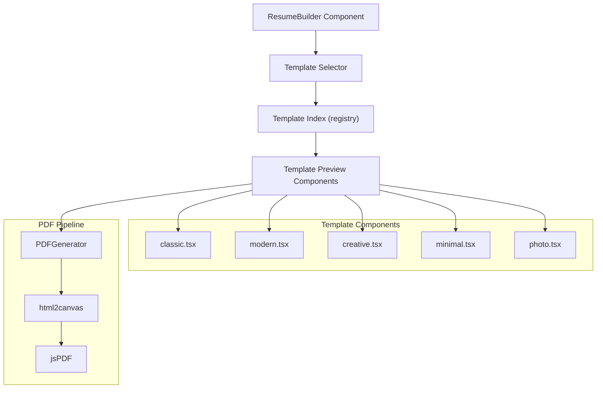

# Template System — Complete Guide

The template system is the visual engine of ApexResume. It transforms structured `ResumeData` into styled HTML for both live preview and PDF export.

---

## Table of Contents

1. [Overview](#1-overview)
2. [Available Templates](#2-available-templates)
3. [Template Architecture](#3-template-architecture)
4. [How Templates Work](#4-how-templates-work)
5. [Template Props & Interface](#5-template-props--interface)
6. [PDF Rendering Pipeline](#6-pdf-rendering-pipeline)
7. [Adding a New Template](#7-adding-a-new-template)
8. [Template Styling Strategy](#8-template-styling-strategy)

---

## 1. Overview

Templates are **pure functional React components** that accept `ResumeData` as props and return styled JSX. Each template:

- Lives in `app/components/templates/preview/`
- Accepts a standard `TemplateProps` interface
- Provides both web display and print-optimized views
- Has isolated styles (no CSS bleed into the main app)
- Supports all resume sections including custom sections

---

## 2. Available Templates

| Template | File | Design Style | Best For |
|----------|------|-------------|----------|
| **Classic** | `classic.tsx` (8.3KB) | Traditional, serif-accented | Corporate, finance, consulting |
| **Modern** | `modern.tsx` (8.0KB) | Clean sans-serif, subtle colors | Tech, startups, product |
| **Creative** | `creative.tsx` (8.2KB) | Bold colors, unique layout | Design, marketing, media |
| **Minimal** | `minimal.tsx` (7.1KB) | Whitespace-heavy, understated | Academic, research, writing |
| **Photo** | `photo.tsx` (10.6KB) | Includes profile photo slot | International markets, creative roles |

### Template Comparison

| Feature | Classic | Modern | Creative | Minimal | Photo |
|---------|---------|--------|----------|---------|-------|
| Profile Photo | ❌ | ❌ | ❌ | ❌ | ✅ |
| Color Accents | Subtle | Medium | Bold | None | Medium |
| Sidebar Layout | ❌ | ❌ | ✅ | ❌ | ✅ |
| ATS Friendly | ⭐⭐⭐ | ⭐⭐⭐ | ⭐⭐ | ⭐⭐⭐ | ⭐⭐ |
| Print Layout | Single-column | Single-column | Two-column | Single-column | Two-column |

---

## 3. Template Architecture



**Directory structure:**
```
app/components/templates/
├── index.tsx              # Template exports & registry
├── preview/
│   ├── index.tsx          # Preview component index (maps ID → component)
│   ├── types.ts           # TemplateProps interface
│   ├── classic.tsx        # Classic template component
│   ├── modern.tsx         # Modern template component
│   ├── creative.tsx       # Creative template component
│   ├── minimal.tsx        # Minimal template component
│   └── photo.tsx          # Photo template component
└── selector/
    ├── index.tsx           # Template selector component
    └── ...                 # Thumbnail previews
```

---

## 4. How Templates Work

### Step 1: User selects a template

The `TemplateSelector` component displays thumbnail previews. When clicked, it updates the `template_id` field on the resume record.

### Step 2: Live preview renders

The `ResumeBuilder` looks up the template component by `template_id` using the registry in `preview/index.tsx`:

```typescript
// Simplified registry lookup
const templates = {
  classic: ClassicTemplate,
  modern: ModernTemplate,
  creative: CreativeTemplate,
  minimal: MinimalTemplate,
  photo: PhotoTemplate,
}

const TemplateComponent = templates[templateId]
return <TemplateComponent data={resumeData} />
```

### Step 3: Template renders sections

Each template renders the same data but with different layouts and styles:

```
PersonalInfo → Header section (name, title, contact)
Experience[] → Work experience section (chronological)
Education[]  → Education section
Skills       → Skills section (grid, tags, or list)
Projects[]   → Projects section
References[] → References section (optional)
CustomSections[] → Dynamic custom sections
```

---

## 5. Template Props & Interface

```typescript
// types.ts — Standard template props

interface TemplateProps {
  data: ResumeData       // Full resume data object
  className?: string     // Additional CSS classes
  scale?: number         // Zoom scale (default: 1)
  isPrintMode?: boolean  // Whether rendering for PDF
}

// Every template MUST accept these props:
export default function ClassicTemplate({ data, className, scale, isPrintMode }: TemplateProps) {
  return (
    <div className={cn("resume-template", className)}>
      {/* Template JSX */}
    </div>
  )
}
```

### ResumeData Shape (for template rendering)

Templates access these fields:

```typescript
data.personalInfo.name       // "John Doe"
data.personalInfo.title      // "Software Engineer"
data.personalInfo.email      // "john@example.com"
data.personalInfo.phone      // "+1234567890"
data.personalInfo.location   // "San Francisco, CA"
data.personalInfo.summary    // "Experienced software engineer..."
data.personalInfo.linkedin   // URL
data.personalInfo.website    // URL

data.experience[]            // Array of work experiences
data.education[]             // Array of education entries
data.skills                  // Skills object (languages, frameworks, tools, etc.)
data.projects[]              // Array of projects
data.references[]            // Array of references (optional)
data.customSections[]        // Array of custom sections (optional)
```

---

## 6. PDF Rendering Pipeline

When the user clicks "Export PDF", the following happens:

```
1. Template Component renders into a hidden container
   └─ Container is positioned offscreen with exact A4 dimensions
   └─ All template styles are inlined (no external CSS dependency)
   └─ Print-specific rules activate (@media print)

2. html2canvas captures the container
   └─ Scale: 2x (for high DPI / retina displays)
   └─ Background: white (explicit)
   └─ Window dimensions: 794 x 1123 pixels (A4 at 96 DPI)

3. jsPDF creates the PDF document
   └─ Format: A4 (210mm x 297mm)
   └─ Orientation: Portrait
   └─ Unit: millimeters
   └─ Image format: JPEG (quality: 0.95) or PNG

4. Page break handling
   └─ Smart detection: avoid cutting through sections
   └─ Each section boundary is checked against page height
   └─ Multi-page resumes: new page added as needed

5. Download triggered
   └─ Filename: "{resume_name}.pdf"
   └─ Browser native download dialog
```

**Three PDF generators** exist for reliability:

| Generator | File | Strategy | Size |
|-----------|------|----------|------|
| **Primary** | `lib/pdf-generator.ts` | html2canvas → jsPDF | 26KB |
| **HTML-Based** | `lib/html-pdf-generator.ts` | Exact HTML → image → PDF | 34KB |
| **Simplified** | `lib/simple-pdf-generator.ts` | Simplified render pipeline | 31KB |

Additionally, `lib/exact-html-generator.ts` (36KB) provides a pixel-perfect HTML rendering engine for edge cases.

---

## 7. Adding a New Template

To add a new template (e.g., "Executive"):

### Step 1: Create the component

```
app/components/templates/preview/executive.tsx
```

```tsx
import { TemplateProps } from './types'

export default function ExecutiveTemplate({ data, className, isPrintMode }: TemplateProps) {
  const { personalInfo, experience, education, skills, projects } = data

  return (
    <div className={`executive-template ${className || ''}`}>
      {/* Header */}
      <header className="executive-header">
        <h1>{personalInfo.name}</h1>
        <p>{personalInfo.title}</p>
        <div className="contact-bar">
          {personalInfo.email && <span>{personalInfo.email}</span>}
          {personalInfo.phone && <span>{personalInfo.phone}</span>}
          {personalInfo.location && <span>{personalInfo.location}</span>}
        </div>
      </header>

      {/* Summary */}
      {personalInfo.summary && (
        <section className="summary">
          <h2>Professional Summary</h2>
          <p>{personalInfo.summary}</p>
        </section>
      )}

      {/* Experience */}
      {experience.length > 0 && (
        <section className="experience">
          <h2>Professional Experience</h2>
          {experience.map(exp => (
            <div key={exp.id} className="experience-item">
              <h3>{exp.jobTitle}</h3>
              <p className="company">{exp.company} | {exp.date}</p>
              <p>{exp.responsibilities}</p>
            </div>
          ))}
        </section>
      )}

      {/* ... remaining sections ... */}
    </div>
  )
}
```

### Step 2: Register the template

In `app/components/templates/preview/index.tsx`:

```typescript
import ExecutiveTemplate from './executive'

export const templates = {
  // ... existing templates
  executive: ExecutiveTemplate,
}
```

### Step 3: Add template metadata

In `lib/template-configs.ts`:

```typescript
export const TEMPLATE_CONFIGS = {
  // ... existing configs
  executive: {
    id: 'executive',
    name: 'Executive',
    description: 'Polished template for senior professionals',
    thumbnail: '/templates/executive-thumb.png',
    category: 'professional',
    atsScore: 3,
  }
}
```

### Step 4: Test

1. Select the new template in the template selector
2. Verify live preview renders correctly
3. Test PDF export with all sections filled
4. Test with empty/partial data
5. Test dark mode rendering
6. Verify print layout (@media print)

---

## 8. Template Styling Strategy

### Isolation

Each template uses **scoped styles** to prevent CSS bleed:

```tsx
// Approach 1: Unique class prefix
<div className="classic-template">
  <h1 className="classic-name">...</h1>
</div>

// Approach 2: Inline styles (for PDF fidelity)
<div style={{ fontFamily: 'Georgia, serif', fontSize: '14px' }}>
  ...
</div>
```

### Print Optimization

Templates include print-specific rules:

```css
@media print {
  .resume-template {
    /* Remove shadows, borders */
    box-shadow: none;
    border: none;
  }

  .no-print {
    /* Hide UI elements (edit buttons, etc.) */
    display: none !important;
  }

  .page-break-before {
    page-break-before: always;
  }
}
```

### Responsive Preview

Templates support zoom/scale for the live preview panel:

```tsx
<div style={{ transform: `scale(${scale})`, transformOrigin: 'top left' }}>
  <TemplateComponent data={resumeData} />
</div>
```

### Typography

| Template | Primary Font | Heading Font |
|----------|-------------|-------------|
| Classic | Georgia (serif) | Georgia |
| Modern | Inter (sans-serif) | Inter |
| Creative | Poppins | Poppins |
| Minimal | Helvetica | Helvetica |
| Photo | Roboto | Roboto |
