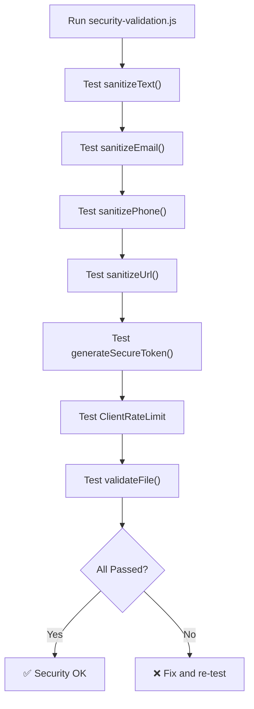

# Testing Strategy

This document covers the testing approach, existing test files, and guidelines for testing ApexResume.

---

## Table of Contents

1. [Testing Overview](#1-testing-overview)
2. [Test Files Reference](#2-test-files-reference)
3. [Security Tests](#3-security-tests)
4. [Manual QA Checklist](#4-manual-qa-checklist)
5. [AI Feature Testing](#5-ai-feature-testing)
6. [PDF Export Testing](#6-pdf-export-testing)
7. [Performance Testing](#7-performance-testing)

---

## 1. Testing Overview

ApexResume uses a multi-layered testing strategy:

| Layer | Type | Tool | Location |
|-------|------|------|----------|
| **Security** | Automated | Custom scripts | `tests/security-validation.js` |
| **CSP** | Automated | Custom scripts | `tests/csp-test.js` |
| **Integration** | Manual + Script | TypeScript tests | `tests/security-test.ts` |
| **Utilities** | Automated | Custom scripts | `tests/date-formatting-demo.ts` |
| **Account Lifecycle** | Script | TypeScript | `tests/delete-account-test.ts` |
| **API Health** | Automated | curl / fetch | `/api/health` endpoint |
| **AI Diagnostic** | Automated | fetch | `/api/ai/diagnostic` endpoint |
| **Manual QA** | Manual | Browser | Checklist below |

---

## 2. Test Files Reference

### `tests/security-validation.js`

**Purpose:** Validates all security utility functions.

**Tests included:**
- Text sanitization (XSS prevention)
- Email validation and cleaning
- Phone number sanitization
- URL security validation
- Secure token generation
- Rate limiting behavior
- File upload validation

**Run:**
```bash
node tests/security-validation.js
```

**Expected output:**
```
✅ Text sanitization: passed
✅ Email validation: passed
✅ Phone sanitization: passed
✅ URL validation: passed
✅ Token generation: passed
✅ Rate limiting: passed
✅ File validation: passed
All security tests passed!
```

---

### `tests/csp-test.js`

**Purpose:** Validates Content Security Policy header generation.

**Tests included:**
- CSP directive formatting
- Default policy generation
- Custom directive merging
- Header output format

**Run:**
```bash
node tests/csp-test.js
```

---

### `tests/security-test.ts`

**Purpose:** Integration tests for the security system.

**Tests included:**
- `CSRFProtection` token generation and validation
- `SessionSecurity` session lifecycle
- `IPSecurity` blocking and suspicious activity tracking
- `SecureValidator` JSON and object sanitization
- `SecurityAudit` event logging and retrieval

**Run:**
```bash
npx tsx tests/security-test.ts
```

---

### `tests/date-formatting-demo.ts`

**Purpose:** Demonstrates and validates date formatting utilities.

**Tests included:**
- Date format conversions (MM/DD/YYYY, DD/MM/YYYY, YYYY-MM-DD)
- Timezone handling
- Relative date formatting
- Edge cases (invalid dates, null values)

**Run:**
```bash
npx tsx tests/date-formatting-demo.ts
```

---

### `tests/delete-account-test.ts`

**Purpose:** Tests the complete account deletion flow.

**Tests included:**
- Profile deletion cascade
- Resume data cleanup
- Cover letter cleanup
- Credit history cleanup
- Storage (avatar) cleanup
- Auth user deletion

**Run:**
```bash
npx tsx tests/delete-account-test.ts
```

> ⚠️ **Warning:** This test deletes data. Only run against test/development databases.

---

## 3. Security Tests

### Automated Security Validation Flow



### What to test manually

| Test Case | Expected Result |
|-----------|----------------|
| Submit `<script>alert('xss')</script>` in name field | Script tags stripped |
| Submit `javascript:alert(1)` as website URL | URL rejected |
| Send 20+ requests in 5 seconds | 429 response after burst limit |
| Access `/dashboard` without auth | Redirect to login |
| Upload a `.exe` file as avatar | File rejected |
| Submit form with SQL injection (`'; DROP TABLE`) | Input sanitized |

---

## 4. Manual QA Checklist

### Authentication Flow

- [ ] **Sign up** with email/password → profile created, redirected to onboarding
- [ ] **Sign in** with existing account → redirected to dashboard
- [ ] **Sign out** → session cleared, redirected to home
- [ ] **Password reset** → reset email sent, password updated
- [ ] **Protected routes** → unauthorized access redirected

### Resume Builder

- [ ] **Create resume** → new resume appears in dashboard
- [ ] **Edit personal info** → changes auto-saved, preview updates
- [ ] **Add experience** → new entry appears, drag-and-drop works
- [ ] **Add education** → new entry with all fields
- [ ] **Add skills** → skills displayed in preview
- [ ] **Add projects** → projects section renders correctly
- [ ] **Add custom sections** → text, list, and table types work
- [ ] **Switch template** → preview re-renders with new template
- [ ] **Drag & drop** → sections reorder correctly
- [ ] **Delete resume** → confirmation dialog, resume removed
- [ ] **Duplicate resume** → copy created with "(Copy)" suffix

### AI Features

- [ ] **Generate summary** → professional summary generated (1 credit)
- [ ] **Generate experience** → bullet points generated (1 credit)
- [ ] **Generate project** → description generated (1 credit)
- [ ] **Analyze resume** → full analysis with charts (3 credits)
- [ ] **ATS score** → score with recommendations (2 credits)
- [ ] **Cover letter** → tailored letter generated (5 credits)
- [ ] **Insufficient credits** → purchase modal shown
- [ ] **Rate limit hit** → appropriate error message

### PDF Export

- [ ] **Export Classic** → clean PDF, text selectable
- [ ] **Export Modern** → styled PDF, correct colors
- [ ] **Export Creative** → two-column layout preserved
- [ ] **Export Minimal** → clean whitespace layout
- [ ] **Export Photo** → photo included in PDF
- [ ] **Multi-page resume** → page breaks at correct positions
- [ ] **Empty sections** → hidden in PDF (no blank headers)

### Profile & Settings

- [ ] **Edit profile** → all fields save correctly
- [ ] **Upload avatar** → image uploaded, displayed across app
- [ ] **Change theme** → light/dark switch works
- [ ] **Notification settings** → toggles save correctly
- [ ] **Date format** → dates throughout app update
- [ ] **Delete account** → confirmation required, data removed

### Responsive Design

- [ ] **Mobile (375px)** → responsive layout, no horizontal scroll
- [ ] **Tablet (768px)** → sidebar collapses, content fits
- [ ] **Desktop (1440px)** → full layout, optimal spacing
- [ ] **Landing page** → all sections responsive

---

## 5. AI Feature Testing

### Test with Diagnostic Endpoint

```bash
curl http://localhost:3000/api/ai/diagnostic
```

### Test Content Generation

```bash
curl -X POST http://localhost:3000/api/ai/generate \
  -H "Content-Type: application/json" \
  -d '{
    "type": "summary",
    "query": "Senior software engineer with 8 years of experience in React and Node.js"
  }'
```

### Test with Insufficient Credits

Set test user credits to 0, then attempt generation. Should return 402.

### Simulate AI Failure

To test circuit breaker behavior:
1. Set an invalid `OPENAI_API_KEY`
2. Make 5+ AI requests (circuit should open)
3. Subsequent requests should fail fast (no API call)
4. Wait 60 seconds (circuit half-opens)
5. One successful request (circuit closes)

---

## 6. PDF Export Testing

### Template Coverage Matrix

| Scenario | Classic | Modern | Creative | Minimal | Photo |
|----------|---------|--------|----------|---------|-------|
| Full resume (all sections) | ✅ | ✅ | ✅ | ✅ | ✅ |
| Minimal (name + 1 experience) | ✅ | ✅ | ✅ | ✅ | ✅ |
| Long resume (3+ pages) | ✅ | ✅ | ✅ | ✅ | ✅ |
| Special characters (é, ñ, ü) | ✅ | ✅ | ✅ | ✅ | ✅ |
| Empty optional sections | ✅ | ✅ | ✅ | ✅ | ✅ |
| Custom sections included | ✅ | ✅ | ✅ | ✅ | ✅ |

### PDF Quality Checks

- [ ] Text is **selectable** (not just an image)
- [ ] Colors match the **web preview**
- [ ] Fonts render **correctly** (no tofu/boxes)
- [ ] Page margins are **consistent**
- [ ] Links are **clickable** in the PDF
- [ ] File size is **reasonable** (< 2MB for single page)

---

## 7. Performance Testing

### Health Check Monitoring

```bash
# Basic health
curl http://localhost:3000/api/health

# Verbose (requires token)
curl -H "Authorization: Bearer YOUR_TOKEN" \
  "http://localhost:3000/api/health?verbose=true"
```

### Load Testing with curl

```bash
# Simulate burst (20 requests in quick succession)
for /L %i in (1,1,20) do @curl -s -o nul -w "%%{http_code} " http://localhost:3000/api/health
```

Expected: First ~20 requests return `200`, then `429` (rate limited).

### Performance Targets

| Metric | Target | How to Measure |
|--------|--------|----------------|
| Page Load (LCP) | < 2.5s | Lighthouse / Web Vitals |
| API Response | < 500ms | `/api/health` verbose |
| Cache Hit Rate | > 80% | `/api/health` verbose |
| Bundle Size (JS) | < 500KB gzipped | `npm run build:analyze` |
| PDF Generation | < 3s | Browser console timing |
| AI Response | < 10s | `/api/ai/generate` timing |
